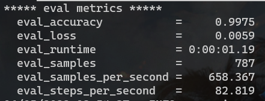

# 基于Bert的带条件的分层级多答案问答

<p align = right> 李厚润 2019202463</p>

## 一. 数据

所有数据集以及数据处理程序都位于`./data/`文件夹下。

$CCKS2022$竞赛提供了5000条训练数据（带标签和回答），1000条测试数据（不带标签和回答），其中我把训练数据划分为了4900条数据量的训练集以及100条数据量的验证集，其位于$FullData$文件夹下。而另外一个文件夹$SampleData$为数据集的抽样，在训练时检验正确性或者较快达到测试目的使用。

$IntermediateFullData$是基于$FullData$文件夹下完整数据集跑出来的中间数据，其中会被同在`./data/`文件夹下的数据处理程序处理。

## 二 思路

整个模型包含两个模块，分别是Sequence Label Model和Text Classification Model，其中这两个模块都是基于Bert模型实现的。

Sequence Label Model用于将只有context和question的文本进行序列标签，标注出对应的condition，fine和coarse。

Text Classification Model用于将第一部分标注出来的标签进行联系，从而得出condition_coarse, condition_fine, coarse_fine的联系。这个模型一共分为两个部分，分别是查找condition和coarse或者fine之间的联系，以及coarse和fine之间的联系，由于两个任务目标的性质不太相同，所以我们把它划分为两个结构一样但是任务目标不同的文本分类模型来完成。

## 三. 实验步骤

### Part 1. Sequence Label Model

#### 1.  预处理模型训练/验证数据集

将所有序列标签所需要的训练数据和验证数据预处理好。

- 处理程序`./data/TokenClassificationDataProcess.py`

- 输入
	- 训练数据集（raw data）：`./data/Fulldata/train_raw.json`
	- 验证数据集（raw data）：`./data/Fulldata/validation_raw.json`
	- 测试数据集（raw data）：`./data/Fulldata/predict_raw.json`

- 输出

	- 训练数据集（processed data）：`./data/Fulldata/train_for_tokClasfy.json`

	- 验证数据集（processed data）：`./data/Fulldata/validation_for_tokClasfy.json`

	- 测试数据集（processed data）：`./data/Fulldata/predict_for_tokClasfy.json`

- 运行命令

	```bash
	cd ./data
	python TokenClassificationDataProcess.py
	```

- 输出样例

	> {"tokens": ["女人肾阴虚吃什么好", "[SEP]", "女", "性", "肾", "阴", "虚", "在", "饮", "食", "上", "建", "议", "多", "吃", "一", "些", "滋", "阴", "的", "食", "物", "，", "比", "如", "山", "药", "、", "枸", "杞", "、", "石", "斛", "、", "玉", "竹", "、", "鸭", "肉", "、", "莲", "子", "、", "百", "合", "等", "等", "，", "[unused1]", "[PAD]", "另", "外", "还", "可", "以", "多", "吃", "一", "些", "黑", "色", "的", "食", "物", "，", "因", "为", "中", "医", "认", "为", "五", "色", "入", "五", "脏", "，", "而", "黑", "色", "的", "食", "物", "是", "入", "肾", "脏", "的", "，", "有", "很", "好", "的", "补", "肾", "功", "效", "。", "[unused1]", "[PAD]", "必", "要", "的", "时", "候", "可", "以", "选", "择", "一", "些", "滋", "阴", "补", "肾", "的", "中", "成", "药", "物", "如", "六", "味", "地", "黄", "丸", "、", "大", "补", "阴", "丸", "、", "左", "归", "丸", "、", "知", "柏", "地", "黄", "丸", "，", "归", "芍", "地", "黄", "丸", "等", "等", "，", "[unused1]", "[PAD]", "需", "要", "在", "中", "医", "师", "的", "指", "导", "下", "辨", "证", "论", "治", "之", "后", "选", "择", "合", "适", "的", "药", "物", "，", "患", "者", "一", "定", "要", "注", "意", "三", "餐", "定", "时", "定", "量", "，", "不", "要", "暴", "饮", "暴", "食", "，", "[unused1]", "[PAD]", "并", "且", "饮", "食", "以", "清", "淡", "、", "营", "养", "、", "易", "消", "化", "为", "主", "。", "[unused1]"], "tags": [0, 1, 0, 0, 0, 0, 0, 0, 0, 0, 0, 0, 0, 0, 0, 0, 0, 4, 5, 5, 5, 5, 0, 0, 0, 6, 7, 0, 6, 7, 0, 6, 7, 0, 6, 7, 0, 6, 7, 0, 6, 7, 0, 6, 7, 0, 0, 0, 0, 0, 0, 0, 0, 0, 0, 0, 0, 0, 0, 4, 5, 5, 5, 5, 0, 0, 0, 0, 0, 0, 0, 0, 0, 0, 0, 0, 0, 0, 0, 0, 0, 0, 0, 0, 0, 0, 0, 0, 0, 0, 0, 0, 0, 0, 0, 0, 0, 0, 0, 0, 0, 0, 0, 0, 0, 0, 0, 0, 0, 0, 0, 4, 5, 5, 5, 5, 5, 5, 5, 5, 0, 6, 7, 7, 7, 7, 0, 6, 7, 7, 7, 0, 6, 7, 7, 0, 6, 7, 7, 7, 7, 0, 6, 7, 7, 7, 7, 0, 0, 0, 0, 0, 0, 0, 0, 0, 0, 0, 0, 0, 0, 0, 0, 0, 0, 0, 0, 0, 0, 0, 0, 0, 0, 0, 0, 0, 0, 0, 0, 0, 0, 0, 0, 0, 0, 0, 0, 0, 0, 0, 0, 0, 0, 0, 0, 0, 0, 0, 0, 0, 0, 0, 0, 0, 0, 0, 0, 0, 0, 0, 0, 0, 0, 0, 0, 0, 0]}

#### 2. Sequence Label Model (train and validation or train)

- 训练程序`./src/tokenizer.py`

- 输入

	- 训练数据集（processed data）：`./data/Fulldata/train_for_tokClasfy.json`

	- 验证数据集（processed data）：`./data/Fulldata/validation_for_tokClasfy.json`
	- 测试数据集（processed data）：`./data/Fulldata/predict_for_tokClasfy.json`

- 输出：`./src/tokenizer`文件夹，其中包含了训练好的模型参数以及预测结果`predictions.txt`

- 运行命令

	```bash
	cd ./src
	python tokenizer.py --model_name_or_path leonadase/bert-base-chinese-finetuned-ner-v1 --train_file ../data/FullData/train_for_tokClasfy.json --validation_file ../data/FullData/validation_for_tokClasfy.json --test_file ../data/FullData/predict_for_tokClasfy.json --do_train --do_eval --do_predict --output_dir ./tokenizer --overwrite_output_dir --overwrite_cache --per_device_train_batch_size 32 --save_strategy "epoch" --evaluation_strategy "epoch" --num_train_epochs 10 --resume_from_checkpoint <checkpoint>
	```

- 训练效果

	

- 输出样例

	>[['[CLS]', '银', '屑', '病', '涂', '抹', '什', '么', '药', '比', '较', '好', '[SEP]', '比', '较', '好', '的', '西', '药', '，', '比', '如', '达', '力', '士', '、', '他', '卡', '西', '醇', '，', '甚', '至', '他', '克', '莫', '司', '等', '都', '是', '比', '较', '好', '的', '药', '物', '。', '还', '有', '润', '肤', '剂', '也', '还', '不', '>错', '。', '另', '外', '中', '药', '，', '[unused1]', '[PAD]', '比', '如', '临', '床', '常', '见', '的', '湿', '毒', '膏', '、', '黄', '连', '膏', '、', '七', '连', '膏', '等', '等', '，', '包', '括', '市', '售', '的', '青', '鹏', '膏', '，', '效', '果', '也', '不', '错', '。', '至', '于', '激', '素', '类', '的', '药', '物', '，', '应', '该', '持', '慎', '用', '的', '态', '度', '。', '[unused1]', '[PAD]', 'r', 'n', '[unused1]', '[SEP]'], [0, 0, 0, 0, 0, 0, 0, 0, 0, 0, 0, 0, 0, 0, 0, 0, 0, 4, 5, 0, 0, 0, 6, 7, 7, 0, 6, 7, 7, 7, 0, 0, 0, 6, 7, 7, 7, 0, 0, 0, 0, 0, 0, 0, 0, 0, 0, 0, 0, 4, 5, 5, 0, 0, 0, 0, 0, 0, 0, 4, 5, 0, 0, 0, 0, 0, 0, 0, 0, 0, 0, 6, 7, 7, 0, 6, 7, 7, 0, 6, 7, 7, 0, 0, 0, 0, 0, 0, 0, 0, 6, 7, 7, 0, 0, 0, 0, 0, 0, 0, 0, 0, 0, 0, 0, 0, 0, 0, 0, 0, 0, 0, 0, 0, 0, 0, 0, 0, 0, 0, 0, 0, 0, 0, 0, 0, 0, 0, 0, 0, 0, 0, 0, 0, 0, 0, 0, 0, 0, 0, 0, 0, 0, 0, 0, 0, 0, 0, 0, 0, 0, 0, 0, 0, 0, 0, 5, 0, 0, 0, 0, 0, 0, 0, 0, 0, 0, 4, 0, 0, 0, 0, 0, 0, 0, 7, 0, 0, 0, 0, 0, 0, 0, 0, 0, 0, 0, 0, 0, 0, 7, 0, 7, 0, 0, 0, 0, 0, 0, 0, 0, 0, 0, 0, 0, 0, 0, 0, 0, 0, 0, 7, 7, 7, 0, 0, 0, 0, 0, 0, 0, 0, 0, 0, 0, 0, 0, 0, 0, 0, 0, 0, 0, 0, 0, 0, 0, 0, 0, 0, 0, 0, 0, 0, 0, 0, 0, 0, 0, 0, 0, 0, 0, 0, 0, 0, 0, 0, 0, 0, 0, 0, 0, 0, 0, 0, 0, 0, 0, 0, 0, 0, 0, 0, 0, 0, 0, 0, 0, 0, 0, 0, 0, 0, 0, 0, 0, 0, 0, 0, 0, 0, 0, 0, 0, 0, 0, 0, 0, 0, 0, 0, 0, 0, 0, 0, 0, 0, 0, 0, 0, 0, 0, 0, 0, 0, 0, 0, 0, 0, 0, 0, 0, 0, 0, 0, 0, 0, 0, 0, 0, 0, 0, 0, 0, 0, 0, 0, 0, 0, 0, 0, 0, 0, 0, 0, 0, 0, 0, 0, 0, 0, 0, 0, 0, 0, 0, 0, 0, 0, 0, 0, 0, 0, 0, 0, 0, 0, 0, 0, 0, 0, 0, 0, 0, 0, 0, 0, 0, 0, 0, 0, 0, 0, 0, 0, 0, 0, 0, 0, 0, 0, 0, 0, 0, 0, 0, 0, 0, 0, 0, 0, 0, 0, 0, 0, 0, 0, 0, 0, 0, 0, 0, 0, 0, 0, 0, 0, 0, 0, 0, 0, 0, 0]]

#### 3. 模型预测数据处理 (post process)

- 处理程序：`./data/TokenClassificationDataProcess.py`

- 输入

	- `./src/tokenizer/predictions.txt`
	- `./data/Fulldata/predict_raw.json`

- 输出

	- `./data/IntermediateFullData/tokenizer_result.json`

- 运行命令

	```bash
	cd ./data
	python TokenClassificationDataProcess.py
	```

- 输出样例

	>{"context": "比较好的西药，比如达力士、他卡西醇，甚至他克莫司等都是比较好的药物。还有润肤剂也还不错。另外中药，\n 比如临床常见的湿毒膏、黄连膏、七连膏等等，包括市售的青鹏膏，效果也不错。至于激素类的药物，应该持慎用的态度。\n rn\n", "question": " 银屑病涂抹什么药比较好？\n", "condition": [], "coarse": [["西药", [4, 6]], ["润肤剂", [36, 39]], ["中药", [46, 48]]], "fine": [["达力士", [9, 12]], ["他卡西醇", [13, 17]], ["他克莫司", [20, 24]], ["湿毒膏", [58, 61]], ["黄连膏", [62, 65]], ["七连膏", [66, 69]], ["青鹏膏", [77, 80]]]}

### Part 2. Text Classification Model

文本分类一共有两类，分别是对condition_coarse及condition_fine，和coarse_fine进行分类。

由于两种任务之间相似性很小，所以我们需要训练两个模型并且分别预测，才能得到更加准确地答案。

#### 1. 预处理模型训练/验证数据集

- 处理程序：`./data/RelationMatchDataProcess.py`

- 输入:
	- 训练数据集（raw data）：`./data/Fulldata/train_raw.json`
	- 验证数据集（raw data）：`./data/Fulldata/validation_raw.json`
	- 测试数据集（raw data）：``./data/IntermediateFullData/tokenizer_result.json"``
- 输出
	- 训练数据集（processed data）：
		- `./data/Fulldata/train_for_matchRelat_condition_x.json`
		- `./data/Fulldata/train_for_matchRelat_coarse_fine.json`
	- 验证数据集（processed data）：
		- `./data/Fulldata/validation_for_matchRelat_condition_x.json`
		- `./data/Fulldata/validation_for_matchRelat_coarse_fine.json`
	- 测试数据集（processed data）：
		- ` ./data/FullData/predict_for_matchRelat_condition_x.json`
		- `./data/FullData/predict_for_matchRelat_coarse_fine.json`

- 运行命令

	```bash
	cd ./data
	python RelationMatchDataProcess.py
	```

- 输出样例

	> {"sentence1": "[unused1]如果纳税人将原有的房产用于生产经营的话[unused2]，就可以从[unused3]生产经营这个月起[unused4]缴纳房产税，如果是自行新建的房屋用于生产经营，", "label": 1, "pair": “[["如果纳税人将原有的房产用于生产经营的话", "生产经营这个月起"], [[0, 19], [24, 32]]]”, "relation": "condition_fine", "ind": 0}

#### 2. Text Classification Model (train and validation and prediction)

- 处理程序：`./src/match_relation.py`

- 输入：一共两组输入，分别对应两个模型，也就是分别condition_coarse及condition_fine，和coarse_fine分类任务的Text Classification Model

	- 第一组
		- `./data/Fulldata/train_for_matchRelat_condition_x.json`
		- `./data/Fulldata/validation_for_matchRelat_condition_x.json`
		- ` ./data/FullData/predict_for_matchRelat_condition_x.json`
	- 第二组
		- `./data/Fulldata/train_for_matchRelat_coarse_fine.json`
		- `./data/Fulldata/validation_for_matchRelat_coarse_fine.json`
		- `./data/FullData/predict_for_matchRelat_coarse_fine.json`

- 输出

	- 第一组：输出`./src/relation_condition_x`文件夹，包含`predict_results.txt`
	- 第二组：输出`./src/relation_coarse_fine`文件夹，包含`predict_results.txt`

- 运行命令

	- 第一组

	  ```bash
	  cd ./src
	  # train over again
	  python match_relation.py  --model_name_or_path bert-base-chinese --train_file ../data/FullData/train_for_matchRelat_condition_x.json  --validation_file ../data/FullData/validation_for_matchRelat_condition_x.json --test_file ../data/FullData/predict_for_matchRelat_condition_x.json --do_train --do_eval --do_predict --num_train_epochs 4 --overwrite_output_dir --output_dir ./relation_condition_x  --overwrite_cache --per_device_train_batch_size 64 --save_strategy "epoch" --evaluation_strategy "epoch"
	  
	  # load model weight from reserved file and do predict only
	  python match_relation.py  --model_name_or_path ./relation_condition_x --train_file ../data/FullData/train_for_matchRelat_condition_x.json  --validation_file ../data/FullData/validation_for_matchRelat_condition_x.json --test_file ../data/FullData/predict_for_matchRelat_condition_x.json  --do_eval --do_predict --num_train_epochs 3 --overwrite_output_dir --output_dir ./relation_condition_x  --overwrite_cache --per_device_train_batch_size 64 --save_strategy "epoch" --evaluation_strategy "epoch"
	  ```

	  

	- 第二组
	
		```bash
		cd ./src
		# train over again
		python match_relation.py  --model_name_or_path bert-base-chinese --train_file ../data/FullData/train_for_matchRelat_coarse_fine.json  --validation_file ../data/FullData/validation_for_matchRelat_coarse_fine.json --test_file ../data/FullData/predict_for_matchRelat_coarse_fine.json --do_train --do_eval --do_predict --num_train_epochs 4 --overwrite_output_dir --output_dir ./relation_coarse_fine  --overwrite_cache --per_device_train_batch_size 64 --save_strategy "epoch" --evaluation_strategy "epoch"
		
		# load model weight from reserved file and do predict only
		python match_relation.py  --model_name_or_path ./relation_coarse_fine --train_file ../data/FullData/train_for_matchRelat_coarse_fine.json  --validation_file ../data/FullData/validation_for_matchRelat_coarse_fine.json --test_file ../data/FullData/predict_for_matchRelat_coarse_fine.json  --do_eval --do_predict --num_train_epochs 3 --overwrite_output_dir --output_dir ./relation_coarse_fine  --overwrite_cache --per_device_train_batch_size 64 --save_strategy "epoch" --evaluation_strategy "epoch"
		```


#### 4. Get Answer

- 处理程序：`./data/GetAnswer.py`

- 输入
	- `./data/IntermediateFullData/tokenizer_result.json`
	- ` ./data/FullData/predict_for_matchRelat_condition_x.json`
	- `./src/relation_condition_x/predict_results.txt`
	- `./data/FullData/predict_for_matchRelat_coarse_fine.json`
	- `./src/relation_coarse_fine/predict_results.txt`
	
- 输出：`./data/answer`

- 运行命令

	```bash
	cd ./data
	python GetAnswer.py
	```

- 输出样例

	> {"context": "早孕的检查首先的项目，就是要进行子宫附件超声的检查，通过子宫附件超声，可以明确为宫内妊娠除外宫外孕，\n 并且通过超声可以看到妊娠囊的位置，是不是存在胎芽胎心。如果明确为宫内活胎，接下来要进行下一步的常规的检查，\n 包括血常规、尿常规、血型、肝肾功能和空腹血糖检查，以及现在目前比较重视的甲功检查。\n 另外还有传染病的检查包括乙肝、丙肝，以及梅毒和艾滋病的检查。另外还有就是要检查患者的心脏，通常是进行心电图。\n 如果患者有心慌等或者既往有心脏病史，要进行心脏超声的检查，这些是最基本的早孕的检查。\n", "question": " 早孕检查有哪些项目\n", "condition": [["如果患者有心慌等或者既往有心脏病史", [206, 223]]], "coarse": [["传染病的检查", [154, 160]]], "fine": [["子宫附件超声的检查", [16, 25]], ["血常规", [109, 112]], ["尿常规", [113, 116]], ["血型", [117, 119]], ["肝肾功能", [120, 124]], ["空腹血糖检查", [125, 131]], ["甲功检查", [143, 147]], ["乙肝", [162, 164]], ["丙肝", [165, 167]], ["梅毒和艾滋病的检查", [170, 179]], ["患者的心脏", [189, 194]], ["心电图", [200, 203]], ["心脏超声的检查", [227, 234]]], "condition_coarse": [], "condition_fine": [[["如果患者有心慌等或者既往有心脏病史", "心脏超声的检查"], [[206, 223], [227, 234]]]], "coarse_fine": [[["传染病的检查", "乙肝"], [[154, 160], [162, 164]]], [["传染病的检查", "丙肝"], [[154, 160], [165, 167]]], [["传染病的检查", "梅毒和艾滋病的检查"], [[154, 160], [170, 179]]]]}

### 四. 测试结果


